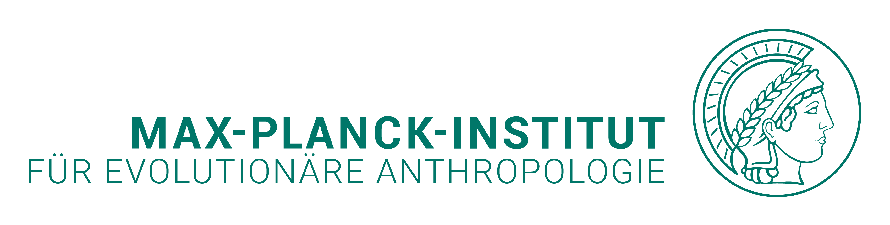

# Acknowledgements

We would like to thank

<!-- tabs:start -->

## **Academic Support**

	The active researchers from the HAAM community, including The Francis Crick Institute (UK), MPI-EVA (DE), Globe Institute (DK), University College Dublin (IE), and University of Zurich (CH), for volunteering to organize this course. We would also like to extend our appreciation to the invited instructors who generously dedicated their time to teach at the summer school.

## **Financial Support**

	
	
	
	 
	 
	The summer school is supported by the Max Planck Institute for Evolutionary Anthropology, Adelphi Genetics Forum, and the International Society of Biomolecular Archaeology.

 

## **Infrastructural Support**

	
	 
	 
	Computing resources are provided by the BMBF-funded de.NBI Cloud within the German Network for Bioinformatics Infrastructure (de.NBI).

 

<!-- tabs:end -->
